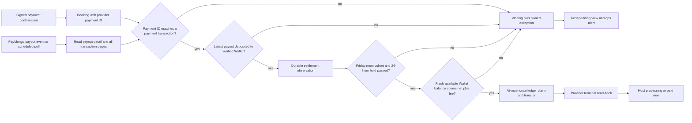

# Phase 26: Settlement-Aware Host Payouts — Research

**Researched:** 2026-09-29  
**Domain:** PayMongo merchant settlement, Wallet-funded disbursement, weekly host payout  
**Confidence:** MEDIUM — official API documentation and source code are available; account entitlement and live response mapping remain unobserved.

## User Constraints

### Locked product decisions (verbatim from 26-CONTEXT.md)

DATA_R7K2P9Q4_START

1. **Revise the prelaunch promise.** Hosts are paid on an eligible Friday after FitOut receives the
   relevant payment, rather than 24 hours after the session. No host has accepted the old promise in
   a live launch, according to the PM's prelaunch answer.
2. **Keep a 24-hour post-session minimum hold.** It is a review window and payout eligibility gate,
   not a deadline or a claim that card disputes end after 24 hours.
3. **Use a fixed weekly host payday.** The first release starts Friday at **12:00 Asia/Manila**.
   Automated retries may run hourly through **23:00 Friday**. A booking missing the Friday cutoff
   enters the next Friday cycle; no automated off-cycle payment is promised or performed.
4. **Do not advance unsettled booking proceeds.** The matching PayMongo payment must be traced to a
   provider payout deposited into FitOut's verified Wallet. The Wallet's available balance must
   cover the net host transfer and applicable transfer fee at dispatch. Other bookings' available
   cash is not a substitute for evidence that this booking's payment settled.
5. **Allow one settlement-record migration.** This is an explicit exception for Phase 26 to the
   original v1.2 Phases 18–23 zero-migration rule. It does not reopen those phases' scope.

DATA_R7K2P9Q4_END

### Implementation boundaries (verbatim from 26-CONTEXT.md)

DATA_M4T8V2Z6_START

- Record a durable, booking-linked settlement proof keyed by booking/payment and provider payout,
  including the observed deposited instant, verification instant, and current provider status.
  Preserve the history when a provider payout is later returned or contradicted. Never infer
  settlement from checkout success, a hosted-page redirect, payout generation, or an `in_transit`
  status. Validate the live account's payout transaction field mapping before relying on it.
- Confirm the actual merchant settlement weekday, payout destination, available-balance read,
  transaction-list access, and fee schedule with the PayMongo account authority. Documentation's
  Wednesday default is an assumption until the account proves it. If the account cannot support
  a Friday host payday, retain HOLD and return the timing conflict to the PM; do not silently
  change host copy or fund the gap from unrelated receipts.
- Refactor payout selection and retries around the Friday window. A booking waiting on settlement
  or funds stays eligible for a future cycle without burning the existing failed-transfer age limit.
  Once a transfer is fired, keep the established at-most-once ledger claim, idempotency key, frozen
  commission, debit netting, refund behavior, and provider read-back. Concurrent runs cannot send
  a second transfer for the same booking.
- The earnings page currently reads only `host_payout_ledger`, whose payout row is normally created
  when the sweep claims it. Its pending view must include confirmed bookings before that claim,
  remain owner-scoped, and avoid claiming an exact Friday until settlement evidence supports one.
  Show processing and paid according to the actual transfer state. Update every host-facing payout
  statement and contractual wording that implies payment at session end plus 24 hours.
- Preserve existing suspension, destination, partial-cancellation, refund, and host-debit gates.
  Missing provider evidence or available funds is an operations exception if a Friday is missed,
  never a reason to pretend a transfer succeeded. Alerts need a monitored owner and an action path.

DATA_M4T8V2Z6_END

### Codex's Discretion

No separate discretion section exists in 26-CONTEXT.md. [VERIFIED: .planning/phases/26-settlement-aware-host-payouts/26-CONTEXT.md:1-87]

### Deferred Ideas (OUT OF SCOPE)

No separate deferred-ideas section exists in 26-CONTEXT.md. [VERIFIED: .planning/phases/26-settlement-aware-host-payouts/26-CONTEXT.md:1-87]

<phase_requirements>
## Phase Requirements

| ID | Description | Research support |
|---|---|---|
| HPAY-01 | Settlement proof | Payout detail, paginated transactions, payment correlation, append-only observations. [VERIFIED: .planning/REQUIREMENTS.md:292-295] |
| HPAY-02 | Weekly eligibility | Friday cohort, Manila clock, session hold, later-cycle wait. [VERIFIED: .planning/REQUIREMENTS.md:296-299] |
| HPAY-03 | Funded transfer gate | Wallet balance and fee preflight with existing host and destination gates. [VERIFIED: .planning/REQUIREMENTS.md:300-303] |
| HPAY-04 | Money-path integrity | Preserve ledger claim, debit/refund rules, provider read-back; separate waiting from attempted failure. [VERIFIED: .planning/REQUIREMENTS.md:304-307] |
| HPAY-05 | Honest host schedule | Owner-scoped projection of confirmed bookings and evidence-driven statuses and dates. [VERIFIED: .planning/REQUIREMENTS.md:308-311] |
| HPAY-06 | Exception ownership | Durable money alert, monitored destination, acknowledgement and recovery path. [VERIFIED: .planning/REQUIREMENTS.md:312-314] |
| HPAY-07 | Release proof | Account-specific entitlement and controlled, jointly authorized proof while HOLD persists. [VERIFIED: .planning/REQUIREMENTS.md:315-318] |
</phase_requirements>

## Summary

Use two independent proofs before a host transfer: a booking's captured payment must appear in the complete transaction list of a provider payout whose latest verified state is deposited into the approved FitOut Wallet; a fresh Wallet read must show spendable funds for the net transfer and fee. PayMongo documents separate payment clearing, merchant payout, and Wallet availability stages. Its schedule is configurable, and the page contains both a Wednesday default and a verified-business bi-weekly statement, so this account's settings are decisive. [VERIFIED: src/lib/db/schema.ts:1152-1155] [CITED: https://docs.paymongo.com/docs/money-movement-payouts] [CITED: https://docs.paymongo.com/docs/money-movement-manage-your-balance]

The current hourly sweep can claim a payout as soon as the post-session hold ends and send it without settlement or balance evidence. The host page reads ledger rows only and presents that hold instant as its expected payment date. Both need explicit refactoring. The current status comments asserting no transfer or payout webhooks are contradicted by PayMongo's current event guide; use signed events as a prompt to re-read provider state, with periodic polling as recovery. [VERIFIED: src/inngest/functions/payout-sweep.ts:121-182] [VERIFIED: src/inngest/functions/payout-sweep.ts:327-377] [VERIFIED: src/app/(host)/host/earnings/page.tsx:64-100] [VERIFIED: src/app/(host)/host/earnings/page.tsx:119-143] [CITED: https://docs.paymongo.com/docs/developer-tools-webhooks-events]

**Primary recommendation:** Plan an append-only settlement observation record, a Friday-noon eligibility cohort with Friday-only dispatch retries, a Wallet-wide funded dispatch gate, and an owner-scoped earnings projection; retain the Phase 25.1 HOLD until live account evidence and the controlled proof are authorized. [VERIFIED: .planning/phases/26-settlement-aware-host-payouts/26-CONTEXT.md:19-89] [VERIFIED: .planning/phases/25.1-paymongo-production-release-readiness-controlled-proofs/25.1-RELEASE-DECISION.md:1-18]

## Architectural Responsibility Map

| Capability | Primary tier | Secondary tier | Rationale |
|---|---|---|---|
| Settlement ingestion and correlation | API / backend | Database / storage | Server credentials retrieve payout detail and transactions; durable observation is the payout gate. [CITED: https://docs.paymongo.com/reference/getpayouttransactions] |
| Friday cohort and transfer dispatch | API / backend | Database / storage | A durable clock/claim is required across concurrent job runs. [VERIFIED: src/inngest/functions/payout-sweep.ts:121-182] |
| Wallet balance and fee preflight | API / backend | PayMongo service | Fresh provider balance is spendable authority. [CITED: https://docs.paymongo.com/reference/retrieve-a-wallet] |
| Host earnings | Frontend server | Database / storage | The existing Server Component already authenticates and scopes by owner. [VERIFIED: src/app/(host)/host/earnings/page.tsx:55-100] |
| Exception response | API / backend | Ops email and console | Existing durable unresolved alert and digest are available for an owned workflow. [VERIFIED: src/inngest/functions/ops-alert-digest.ts:81-149] |
| Release authorization | Human operations | PayMongo account authority | Local tests and registered jobs do not clear the existing HOLD. [VERIFIED: .planning/phases/25.1-paymongo-production-release-readiness-controlled-proofs/25.1-RELEASE-DECISION.md:1-18] |

## Project Constraints (from AGENTS.md)

- Before implementation changes involving Next.js, read the relevant installed guide under `node_modules/next/dist/docs/` and heed deprecations. The installed Server and Client Components guide says pages default to Server Components and server data/secrets belong there. [VERIFIED: AGENTS.md:1-5] [VERIFIED: node_modules/next/dist/docs/01-app/01-getting-started/05-server-and-client-components.md:1-43]
- Project skill guidance for Neon recommends migrations as code and direct connections for migration runs; it is guidance, while the existing Drizzle migration system is the local pattern. [CITED: https://neon.com/docs/guides/drizzle.md] [VERIFIED: .agents/skills/neon-postgres/SKILL.md:48-66]

## Standard Stack

| Existing component | Local version / evidence | Required use |
|---|---|---|
| Next.js App Router | `"next": "^16.2.7"` [VERIFIED: package.json:56-56] | Keep the earnings page server-rendered and owner-scoped. [VERIFIED: src/app/(host)/host/earnings/page.tsx:55-100] |
| Inngest | `"inngest": "^4.13.0"` [VERIFIED: package.json:53-53] | Use the installed two-argument `createFunction` pattern and a Manila timezone cron. [VERIFIED: src/inngest/functions/payout-sweep.ts:364-378] [CITED: https://www.inngest.com/docs/reference/typescript/functions/triggers] |
| Drizzle ORM / PostgreSQL | `"drizzle-orm": "^0.45.2"`, `"postgres": "^3.4.9"` [VERIFIED: package.json:52-59] | One reviewed migration for settlement evidence; SQL guards for claim and state transitions. [VERIFIED: src/lib/db/schema.ts:650-687] |
| Vitest | Installed project test runner; `"test": "vitest run"` [VERIFIED: package.json:27-35] | Isolated-schema payment and payout integration tests. [VERIFIED: vitest.config.ts:1-35] |
| Existing PayMongo REST wrapper | Versioned paths and Basic-auth fetch [VERIFIED: src/lib/paymongo.ts:23-24] [VERIFIED: src/lib/paymongo.ts:89-115] | Extend with read-only payout, transaction and Wallet-detail reads. [CITED: https://docs.paymongo.com/reference/getpayouttransactions] [CITED: https://docs.paymongo.com/reference/retrieve-a-wallet] |

No new package is recommended. Registry version and package-legitimacy gates are therefore inapplicable to this phase. [VERIFIED: package.json:1-60]

## Architecture Patterns

### System architecture diagram



The flow is a recommended decomposition of the locked gates, not a claim that all provider read capabilities are enabled for this account. [VERIFIED: .planning/phases/26-settlement-aware-host-payouts/26-CONTEXT.md:19-69]

### Settlement observation and correlation

Use the allowed migration to store a booking/payment/payout/transaction correlation and a history of status observations. Store deposited-at as the provider's status update instant and verified-at as the time FitOut successfully re-read it; keep current status derivable without overwriting a prior deposited observation. Validate payment transaction type, live mode, organization, currency, payment ID and payout ID against an actual account response. The published example includes `type: "payment"`, `attributes.payment_id`, `attributes.payout_id` and a cursor, but the docs' field table describes `payment_id` only for certain other transaction types; this inconsistency makes a captured account fixture mandatory. [CITED: https://docs.paymongo.com/reference/payout-resources] [CITED: https://docs.paymongo.com/reference/getpayouttransactions] [ASSUMED] An append-only observation table is the best fit within one migration.

Read *every* transaction page until `pagination.next_cursor` is null before deciding the payment is absent; the endpoint defaults to 20 records and exposes `after`/`before` cursors. A partial first page cannot prove absence. A deposited payout's `last_payout_transfer` can describe downstream forwarding, so prove the approved Wallet destination rather than relying on payout status alone. [CITED: https://docs.paymongo.com/reference/getpayouttransactions] [CITED: https://docs.paymongo.com/reference/payout-resources] [CITED: https://docs.paymongo.com/docs/money-movement-payouts]

Treat signed `payout.deposited` and `payout.returned` as invalidation/refresh signals; re-read the payout and transaction list for authority. PayMongo's current event guide also lists `transfer.outward.successful` and `transfer.outward.failed`, contrary to old source comments claiming none exist. Keep periodic read-back for missed delivery and unknown states. Confirm the account's subscriptions and entitlement before relying on those events. [CITED: https://docs.paymongo.com/docs/developer-tools-webhooks-events] [VERIFIED: src/inngest/functions/payout-reconcile.ts:1-11] [VERIFIED: src/lib/paymongo.ts:748-765]

### Weekly cohort and funded dispatch

At Friday 12:00 Manila, determine the cohort whose session hold has elapsed and whose matching settlement is verified. Preserve that cohort through hourly Friday retry passes ending 23:00; late hold or settlement evidence enters the following Friday, as the acceptance scenarios require. For each attempt, re-check current booking/refund, suspension, destination, payout-enabled, settlement status and available Wallet balance. The current SQL already covers partial cancellation and several host gates; retain those predicates when adding Friday and settlement gates. [VERIFIED: .planning/phases/26-settlement-aware-host-payouts/26-CONTEXT.md:30-69] [VERIFIED: src/inngest/functions/payout-sweep.ts:121-182]

The provider's Wallet read is `GET /v2/wallets/{id}` with `fields=balance`; its exact live response path and account access need confirmation. PayMongo distinguishes available from pending balance and says disbursement needs amount plus fee; the published standard InstaPay/PESONet fee is PHP 10 and the account may have a different rate or free weekly transfer. Size the gate from the verified account fee, conservatively when uncertain. Multiple Friday workers and other outbound money paths can race the same Wallet balance; serialize or reserve at Wallet scope, re-read near dispatch, and treat provider insufficient-balance rejection as waiting/exception. [CITED: https://docs.paymongo.com/reference/retrieve-a-wallet] [CITED: https://docs.paymongo.com/docs/money-movement-manage-your-balance] [CITED: https://docs.paymongo.com/docs/money-movement-disbursements] [ASSUMED] Wallet-wide serialization is the appropriate local concurrency mechanism.

### Integrity of an uncertain transfer

The ledger has a composite unique claim. Exact current enum values are `"held", "processing", "paid", "refunded", "failed"` and kinds are `"payout", "host_cancel_fee"`. Retain `kind = 'payout'` on every payout read/write and preserve the frozen commission and recovered debit on retries. [VERIFIED: src/lib/db/schema.ts:627-639] [VERIFIED: src/lib/db/schema.ts:650-687] [VERIFIED: src/inngest/functions/payout-sweep.ts:227-245] [VERIFIED: src/inngest/functions/payout-sweep.ts:259-325]

**Critical change:** PayMongo says idempotency keys expire after 24 hours. The current retry bound is `PAYOUT_RETRY_MAX_AGE_HOURS` with default `72`, and the transfer key is `host-external-payout:${bookingId}`. That key alone cannot prove at-most-once over a weekly deferral or a crash after provider acceptance. Plan provider read-back by stored transfer/batch/reference before any uncertain retry; if the prior result cannot be proved absent, freeze and alert rather than POST again. A definitive provider failure may need a separate operator-reviewed retry policy; a missing settlement/balance is never a failed transfer attempt. [CITED: https://docs.paymongo.com/reference/idempotent-requests] [CITED: https://docs.paymongo.com/docs/money-movement-best-practices] [VERIFIED: src/lib/payments/config.ts:28-37] [VERIFIED: src/lib/paymongo.ts:556-593]

### Host view and operations

Project confirmed booking rows into the owner-scoped earnings read before payout ledger creation, without creating a transfer claim. Existing ledger rows remain the authority for processing/paid/refunded. The approved UI contract requires a server-derived preclaim amount labeled `Estimated payout` with an estimate qualifier; when a defensible amount is unavailable, show `Amount being confirmed` and exclude it from the pending total. Do not show an exact Friday without verified settlement. [VERIFIED: src/app/(host)/host/earnings/page.tsx:64-100] [VERIFIED: src/inngest/functions/payout-sweep.ts:220-245] [VERIFIED: .planning/phases/26-settlement-aware-host-payouts/26-CONTEXT.md:47-54] [APPROVED POLICY: .planning/phases/26-settlement-aware-host-payouts/26-UI-SPEC.md, Copywriting Contract and Interaction Contract item 4]

Use the existing unresolved `needs_attention` audit path and daily ops digest as the base, but define a monitored owner, acknowledgement, escalation and recovery action for missed Friday, returned settlement, insufficient funds and failed/stuck transfer. A daily digest alone does not prove a Friday 23:00 exception was acknowledged. The `/terms` route is currently an explicit nonbinding placeholder; changing its outline is not equivalent to publishing binding terms. [VERIFIED: src/inngest/functions/ops-alert-digest.ts:81-149] [VERIFIED: src/app/(legal)/terms/page.tsx:1-31] [VERIFIED: .planning/phases/25.1-paymongo-production-release-readiness-controlled-proofs/25.1-RELEASE-DECISION.md:1-18]

### Recommended file map

| Responsibility | Existing seam / recommended location |
|---|---|
| Provider reads | Extend `src/lib/paymongo.ts` [VERIFIED: src/lib/paymongo.ts:89-115] |
| Settlement model | `src/lib/db/schema.ts` plus one new `drizzle` migration [VERIFIED: src/lib/db/schema.ts:650-687] [ASSUMED] |
| Ingestion and refresh | Extend signed webhook route and add a testable settlement reconciler [VERIFIED: src/app/api/paymongo/webhook/route.ts:25-87] [ASSUMED] |
| Weekly dispatch | Refactor `src/inngest/functions/payout-sweep.ts` [VERIFIED: src/inngest/functions/payout-sweep.ts:360-378] |
| Transfer terminal | Preserve/refine `src/inngest/functions/payout-reconcile.ts` [VERIFIED: src/inngest/functions/payout-reconcile.ts:85-142] |
| Earnings and copy | `src/app/(host)/host/earnings/page.tsx`, `src/components/host/payout-ledger-status.ts`, host/booking copy, legal publication path [VERIFIED: src/app/(host)/host/earnings/page.tsx:119-143] [VERIFIED: src/components/host/payout-ledger-status.ts:21-81] |

## Don't Hand-Roll

| Problem | Do not build | Use instead | Why |
|---|---|---|---|
| Payment-to-payout proof | Settlement inferred from checkout redirect or elapsed time | PayMongo payout detail and complete transaction list | Clearing and payout are distinct from payment success. [CITED: https://docs.paymongo.com/docs/money-movement-payouts] [CITED: https://docs.paymongo.com/reference/getpayouttransactions] |
| Transfer deduplication | Application read-then-POST | Existing DB unique claim plus provider reference/read-back | Key expiry makes a long-later replay unsafe. [VERIFIED: src/lib/db/schema.ts:683-686] [CITED: https://docs.paymongo.com/reference/idempotent-requests] |
| Money arithmetic | Floating point or client recomputation | Existing integer centavos commission and frozen ledger | Existing ledger is the host money authority. [VERIFIED: src/lib/db/schema.ts:662-675] |
| Time scheduling | Local machine timezone or a UI clock | Inngest timezone cron and database timestamp gate | Current jobs already use Manila-qualified cron. [VERIFIED: src/inngest/functions/payout-sweep.ts:364-378] [CITED: https://www.inngest.com/docs/reference/typescript/functions/triggers] |
| Webhook trust | Raw event body as settlement authority | Existing signature verification and event-ID dedupe, followed by provider read | A signed event can trigger revalidation while polling covers missed events. [VERIFIED: src/app/api/paymongo/webhook/route.ts:89-122] [CITED: https://docs.paymongo.com/docs/developer-tools-webhooks-events] |

## Runtime State Inventory

This phase introduces a schema migration and changes live payout scheduling, so planning must account for runtime state outside source files. [VERIFIED: .planning/phases/26-settlement-aware-host-payouts/26-CONTEXT.md:19-54]

| Category | Items found or evidence boundary | Action required |
|---|---|---|
| Stored data | Existing booking `payment_id` and financial ledger rows exist in the schema; live row counts and any old unsettled bookings were **not** inspected under HOLD. [VERIFIED: src/lib/db/schema.ts:1152-1155] [VERIFIED: src/lib/db/schema.ts:650-687] | Migration must preserve existing rows; plan an explicit backfill/unknown-state policy after authorized inventory. No fabricated settlement proof from old rows. |
| Live service config | PayMongo payout schedule, Wallet/forwarding workflow, event subscriptions, API entitlements and Inngest deployed job state live outside Git; current account values remain unobserved. [CITED: https://docs.paymongo.com/docs/money-movement-payouts] [VERIFIED: .planning/phases/25.1-paymongo-production-release-readiness-controlled-proofs/25.1-RELEASE-DECISION.md:1-18] | Account authority verifies settings; deployment operator checks that only the Friday dispatch schedule is active and old hourly dispatch is disabled. |
| OS-registered state | No OS scheduler is represented by the source-controlled payout path; the repo mounts Inngest jobs, but actual host OS registrations were not queried. [VERIFIED: src/app/api/inngest/route.ts:25-26] [VERIFIED: src/app/api/inngest/route.ts:100-105] | Deployment operator confirms no separate OS-run payout job before enabling; keep HOLD on any unowned duplicate. |
| Secrets/env vars | `.env.example` declares `PAYOUT_DELAY_HOURS=24`, platform Wallet settings and `OPS_ALERT_EMAIL`; actual deployment values were not read. [VERIFIED: .env.example:139-155] [VERIFIED: .env.example:185-192] | Audit deployed values without printing secrets. Keep the 24-hour hold a minimum even if an old override differs; choose an accountable monitored alert destination. |
| Build artifacts/installed packages | Local installed Next, Vitest and Drizzle modules exist; deployed build/version and registered Inngest function schedule were not inspected. [VERIFIED: local file-existence probe, 2026-09-29] | Rebuild/deploy after code and migration review, inspect registered schedule, and prevent the old hourly function from dispatching. |

## Common Pitfalls

1. **Wednesday assumption:** the guide gives a default but also describes configurable and verified-business schedules. Obtain the actual account schedule and Wallet destination; if Friday cannot be funded, retain HOLD. [CITED: https://docs.paymongo.com/docs/money-movement-payouts] [VERIFIED: .planning/phases/26-settlement-aware-host-payouts/26-CONTEXT.md:35-43]
2. **Wrong transaction field:** payment rows in the sample carry both resource ID and `attributes.payment_id`, while the same page's field table limits `payment_id` differently. Validate mapping using redacted live-account evidence; do not guess. [CITED: https://docs.paymongo.com/reference/payout-resources]
3. **False deposited proof:** `in_transit`, payout generation, `available_at`, or a balance of unrelated funds cannot authorize this booking. A returned status must supersede prior deposited observation without deleting history. [CITED: https://docs.paymongo.com/reference/payout-resources] [VERIFIED: .planning/phases/26-settlement-aware-host-payouts/26-CONTEXT.md:23-36]
4. **Short provider idempotency:** key expiry after 24 hours is shorter than current 72-hour retry. Unknown create outcomes require read-back and human escalation if unresolved. [CITED: https://docs.paymongo.com/reference/idempotent-requests] [VERIFIED: src/lib/payments/config.ts:28-37]
5. **Wrong Friday cohort:** a booking without its completed hold and settlement proof by Friday noon waits until the next Friday, even if it qualifies during afternoon retries; those retries serve only the fixed noon cohort. [VERIFIED: .planning/phases/26-settlement-aware-host-payouts/26-CONTEXT.md:56-69] [APPROVED POLICY: .planning/phases/26-settlement-aware-host-payouts/26-UI-SPEC.md, Interaction Contract item 6]
   The current `PAYOUT_DELAY_HOURS` default is `24` but an environment override is allowed; enforce the PM's minimum even if that override is shorter. [VERIFIED: src/lib/payments/config.ts:21-22]
6. **Fee and balance race:** a balance sufficient for one transfer may be insufficient for concurrent transfers or the fee. Check close to dispatch and coordinate Wallet-wide. [CITED: https://docs.paymongo.com/docs/money-movement-disbursements] [ASSUMED] Database coordination is required to make the preflight useful under concurrent callers.
7. **Invisible preclaim earnings:** current earnings query starts from payout ledger; a confirmed booking has no payout row until sweep claim. [VERIFIED: src/app/(host)/host/earnings/page.tsx:74-98] [VERIFIED: src/inngest/functions/payout-sweep.ts:227-245]
8. **Overbroad migration/copy:** preserve signed debit kind and partial-cancellation payout basis; the legal page is a nonbinding placeholder with a separate publication gate. [VERIFIED: src/inngest/functions/payout-sweep.ts:121-159] [VERIFIED: src/app/(legal)/terms/page.tsx:1-31]

## Code Examples

The following is **planning pseudocode**, not a provider response parser or executable SQL. The discrete values shown are quoted from their source above: `"held", "processing", "paid", "refunded", "failed"` and `"payout", "host_cancel_fee"`. [VERIFIED: src/lib/db/schema.ts:627-639]

```text
Friday 12:00 Manila:
  snapshot cohort where hold elapsed and latest booking-linked settlement is deposited
Friday 12:00–23:00 Manila, once per eligible booking:
  re-read payout status + Wallet available balance and fee
  if any proof or gate is missing: keep waiting; record exception when cutoff is missed
  else: acquire durable payout claim; preserve frozen net/debit
        if prior provider outcome is uncertain: read back; never blindly POST
        otherwise send one transfer and record transfer ID
reconciler:
  read provider transfer until terminal; update processing to paid or failed
```

The shape follows the locked phase constraints and the current claim/reconcile split. [VERIFIED: .planning/phases/26-settlement-aware-host-payouts/26-CONTEXT.md:19-69] [VERIFIED: src/inngest/functions/payout-sweep.ts:227-245] [VERIFIED: src/inngest/functions/payout-reconcile.ts:102-142]

## State of the Art

| Earlier assumption | Current documented position | Planning impact |
|---|---|---|
| No payout/transfer webhook [VERIFIED: src/inngest/functions/payout-reconcile.ts:1-11] | PayMongo documents `payout.deposited`, `payout.returned`, `transfer.outward.successful`, `transfer.outward.failed`. [CITED: https://docs.paymongo.com/docs/developer-tools-webhooks-events] | Add signed-event handling only after entitlement confirmation; keep read-back. |
| Key makes retries indefinitely safe [VERIFIED: src/lib/payments/config.ts:28-37] | PayMongo documents 24-hour expiry. [CITED: https://docs.paymongo.com/reference/idempotent-requests] | Reconcile uncertain sends before retry and never rely on a prior key after expiry. |
| Wallet balance is implicit in payout status [ASSUMED] | Available and pending Wallet balances differ. [CITED: https://docs.paymongo.com/docs/money-movement-manage-your-balance] | Require a fresh available-balance read and fee allowance. |

## Assumptions Log

| # | Claim needing confirmation | Risk if wrong |
|---|---|---|
| A1 | [ASSUMED] An append-only observation table in one migration is the best storage shape. | Migration may need a separate current projection or stronger uniqueness constraints. |
| A2 | [ASSUMED] Wallet-wide database serialization is sufficient for concurrent FitOut dispatch paths. | External Wallet movements can still race; provider rejects must stay safe. |
| A3 | [RESOLVED POLICY] The approved UI-SPEC Copywriting Contract requires server-derived `Estimated payout` with an estimate qualifier; when no defensible estimate is available, use `Amount being confirmed` and exclude that booking from pending total. | Runtime amount defensibility still must be checked; the approved label does not establish a settled amount or Friday date. |
| A4 | [ACCOUNT EVIDENCE PENDING] Account entitlement and live payout/Wallet response fields are unknown. The design fails closed and retains HPAY-07 HOLD until Plan 26-09 Task 2 records account-owned redacted evidence in `26-ACCOUNT-AND-RELEASE-PROOF.md`. | No documentation shape or test fixture authorizes settlement correlation, funding proof, or transfer for this account. |
| A5 | [RESOLVED POLICY] CONTEXT decision 3 and approved UI-SPEC Interaction Contract item 6 fix the Friday 12:00 Asia/Manila cohort; hourly retries through 23:00 serve that cohort only, and bookings qualifying after noon wait until the next Friday. | Actual account settlement weekday and Friday funding feasibility remain unobserved under Q1 and HPAY-07 HOLD. |

## Planning Resolutions and Account Evidence Gates

All five research questions have a planning disposition. The account-specific values below remain unknown; HPAY-07 HOLD stays in force until the named authorities supply redacted observations and the separate one-way decision is made. No planning resolution is a live-account verification or transfer permission.

1. **Q1 — RESOLVED FOR PLANNING / ACCOUNT EVIDENCE PENDING.** Design decision: do not infer Friday funding from the product schedule or provider documentation; a mismatch retains HOLD and returns the timing conflict to the PM. Owner: PayMongo account authority. Checkpoint: Plan 26-09 Task 2. Artifact: `26-ACCOUNT-AND-RELEASE-PROOF.md` records redacted observed merchant payout weekdays, actual Wallet destination, forwarding workflow, holiday handling, timestamp, and evidence reference, or an owned HOLD. [CITED: https://docs.paymongo.com/docs/money-movement-payouts]
2. **Q2 — RESOLVED FOR PLANNING / ACCOUNT EVIDENCE PENDING.** Design decision: require exact payment-ID correlation and complete pagination; unknown or contradictory mapping prevents settlement proof and retains HOLD. Owner: PayMongo account authority. Checkpoint: Plan 26-09 Task 2. Artifact: `26-ACCOUNT-AND-RELEASE-PROOF.md` records a redacted account-owned payout transaction response, `payment` or `split_payment` field mapping, all-page traversal evidence, timestamp, and disposition. [CITED: https://docs.paymongo.com/reference/payout-resources]
3. **Q3 — RESOLVED FOR PLANNING / ACCOUNT EVIDENCE PENDING.** Design decision: require fresh authoritative available Wallet balance plus actual transfer fee before dispatch; denied access, unknown fee, or insufficient balance retains HOLD. Owners: PayMongo account authority and money operations. Checkpoint: Plan 26-09 Task 2. Artifact: `26-ACCOUNT-AND-RELEASE-PROOF.md` records redacted available-balance field and permission, applicable fee/free-transfer schedule, timestamp, and disposition. [CITED: https://docs.paymongo.com/reference/retrieve-a-wallet] [CITED: https://docs.paymongo.com/docs/money-movement-disbursements]
4. **Q4 — RESOLVED POLICY.** CONTEXT decision 3 fixes Friday 12:00 first release, hourly retries through 23:00 Friday, and missed cutoff next cycle; approved UI-SPEC Interaction Contract item 6 fixes the noon cohort and excludes post-noon qualification until the next Friday. The approved Copywriting Contract permits `Estimated payout` only for a defensible server-derived amount, otherwise `Amount being confirmed`. These are planning authorities, not evidence of account capability. [APPROVED POLICY: 26-CONTEXT.md and 26-UI-SPEC.md]
5. **Q5 — RESOLVED FOR PLANNING / ACCOUNT EVIDENCE PENDING.** Design decision: an unowned, unacknowledged, or unrecoverable exception retains HOLD; no daily digest alone clears it. Owners: product authority must designate a named money-operations owner, who accepts the monitored recipient, acknowledgement deadline, escalation, and stop/return procedure. Checkpoints: Plan 26-09 Task 2 records operational readiness and Task 3 decides one bounded proof or HOLD. Artifact: `26-ACCOUNT-AND-RELEASE-PROOF.md` records owner acceptance, alert and recovery evidence references, timestamps, and unresolved HOLD fields. [VERIFIED: .planning/phases/25.1-paymongo-production-release-readiness-controlled-proofs/25.1-RELEASE-DECISION.md:1-18]

## Environment Availability

| Dependency | Needed for | Observation | Fallback |
|---|---|---|---|
| Node.js | App and tests | `v24.13.0`, meets package `">=24.2"`. [VERIFIED: package.json:5-7] [VERIFIED: local `node --version` probe, 2026-09-29] | — |
| Local Vitest / Drizzle Kit / Next modules | Test/build/migration design | Installed paths observed. [VERIFIED: local file-existence probe, 2026-09-29] | — |
| Docker CLI | Local PostgreSQL test database | Present; daemon not probed. [VERIFIED: local `Get-Command docker` probe, 2026-09-29] | Existing isolated-schema test setup when daemon is running. |
| npm CLI | Scripts/package-manager commands | The local invocation failed because its `npm-cli.js` target was missing. [VERIFIED: local `npm --version` failing output, 2026-09-29] | Use an installed Node module binary for local checks or repair npm before execution. |
| PayMongo account/API | Settlement, balance and controlled proof | Not probed under Phase 25.1 HOLD. [VERIFIED: .planning/phases/25.1-paymongo-production-release-readiness-controlled-proofs/25.1-RELEASE-DECISION.md:1-18] | Account authority checkpoint; no provider action during research. |

## Validation Architecture

### Test framework

| Property | Value |
|---|---|
| Framework | Vitest, project `vitest run` script. [VERIFIED: package.json:27-35] |
| Config | `vitest.config.ts`, isolated test database and per-file schema. [VERIFIED: vitest.config.ts:1-35] |
| Quick run | `node node_modules/vitest/vitest.mjs run tests/payments/payout-sweep.test.ts tests/payments/payout-reconcile.test.ts` (after DB setup). [VERIFIED: local module-existence probe, 2026-09-29] |
| Full relevant run | `node node_modules/vitest/vitest.mjs run tests/payments tests/paymongo tests/host tests/ops` (after DB setup). [ASSUMED] Command grouping should be measured for runtime before use as a per-task gate. |

### Requirement-to-test map

| Req | Necessary automated evidence | Wave 0 gap |
|---|---|---|
| HPAY-01 | Paginated matching, wrong ID/mode/destination, returned and out-of-order observation, stale read fail-closed, migration replay. [CITED: https://docs.paymongo.com/reference/getpayouttransactions] | New settlement tests and provider fixtures. |
| HPAY-02 | Manila Friday noon boundary, 23:00 last retry, Thursday/Saturday refusal, session ends Thursday afternoon, delayed deposit next cycle. [VERIFIED: .planning/phases/26-settlement-aware-host-payouts/26-CONTEXT.md:56-69] | Extend payout-sweep tests. |
| HPAY-03 | Unknown/insufficient balance, net-plus-fee, concurrent bookings, host/destination gate changes. [CITED: https://docs.paymongo.com/docs/money-movement-disbursements] | Wallet read mock and concurrency cases. |
| HPAY-04 | Duplicate cron/uncertain provider response beyond 24h key TTL, debit memo, partial cancellation, refunds, terminal read-back. [CITED: https://docs.paymongo.com/reference/idempotent-requests] | Extend payout and refund suites. |
| HPAY-05 | Preclaim booking appears only for owner; waiting/scheduled/processing/paid/refunded/attention copy and no unsupported date. [VERIFIED: .planning/REQUIREMENTS.md:308-311] | Extend earnings view and legal-copy tests. |
| HPAY-06 | Missed cutoff creates durable unresolved alert, monitored digest/ack and recovery cause; no account data leaked. [VERIFIED: .planning/REQUIREMENTS.md:312-314] | New ops exception tests. |
| HPAY-07 | Redacted account-specific observation and controlled authorized proof. [VERIFIED: .planning/REQUIREMENTS.md:315-318] | Manual release checkpoint; local tests cannot satisfy it. |

### Sampling

- Per task: run the affected isolated payment/host test file and typecheck. [VERIFIED: vitest.config.ts:1-35]
- Per wave: run relevant money suites and migration replay. [VERIFIED: vitest.config.ts:1-35]
- Phase gate: full suite plus a separate authorized account-proof review; no automated result converts HOLD to release. [VERIFIED: .planning/phases/25.1-paymongo-production-release-readiness-controlled-proofs/25.1-RELEASE-DECISION.md:1-18]

## Security Domain

`security_enforcement` is enabled in project config. [VERIFIED: .planning/config.json:40-40]

| ASVS category | Applies | Phase control |
|---|---|---|
| V2 Authentication | yes | PayMongo Basic credentials on server and signature-verified webhooks; no host-callable provider read. [VERIFIED: src/lib/paymongo.ts:62-70] [VERIFIED: src/app/api/paymongo/webhook/route.ts:89-122] |
| V3 Session Management | yes | Earnings page re-checks the session and host standing on the server. [VERIFIED: src/app/(host)/host/earnings/page.tsx:55-62] |
| V4 Access Control | yes | Scope earnings/settlement rows to authenticated host; staff-only exception details. [VERIFIED: src/app/(host)/host/earnings/page.tsx:64-98] |
| V5 Input Validation | yes | Reject unmatched provider IDs, wrong status, incomplete pagination, non-Wallet destination and stale/unknown balance. [CITED: https://docs.paymongo.com/reference/payout-resources] |
| V6 Cryptography | yes | Reuse signature verification and existing encrypted destination path; do not log account name/number. [VERIFIED: src/app/api/paymongo/webhook/route.ts:89-122] [VERIFIED: src/lib/db/schema.ts:352-375] |

The principal threats are spoofed settlement (Spoofing), altered/mis-correlated provider data (Tampering), cross-host exposure (Information disclosure), double payout from retry/concurrency (Tampering), and lost exceptions (Repudiation/Denial of service). The mitigations are provider re-read, exact ID/Wallet matching, owner scope, DB claim plus provider read-back, and durable owned alerts respectively. [VERIFIED: .planning/phases/26-settlement-aware-host-payouts/26-CONTEXT.md:19-69] [CITED: https://docs.paymongo.com/reference/idempotent-requests]

## Sources

### Primary product and API documentation (MEDIUM under `classify-confidence --provider websearch --verified`)

- [PayMongo Payouts](https://docs.paymongo.com/docs/money-movement-payouts) — clearing, schedule, status, Wallet destination; page says updated 3 months ago.
- [PayMongo payout list](https://docs.paymongo.com/reference/getpayoutlist), [detail](https://docs.paymongo.com/reference/getpayoutdetail), [transactions](https://docs.paymongo.com/reference/getpayouttransactions), [resources](https://docs.paymongo.com/reference/payout-resources) — correlation fields, statuses, cursors; pages say updated 4–5 months ago.
- [PayMongo Wallet balance](https://docs.paymongo.com/docs/money-movement-manage-your-balance), [Retrieve a Wallet](https://docs.paymongo.com/reference/retrieve-a-wallet) — available versus pending and V2 read; pages say updated 5–11 months ago.
- [PayMongo Disbursements](https://docs.paymongo.com/docs/money-movement-disbursements), [Money Movement Best Practices](https://docs.paymongo.com/docs/money-movement-best-practices), [Idempotent Requests](https://docs.paymongo.com/reference/idempotent-requests) — fee, transfer and expiring key; current pages crawled on research date.
- [PayMongo Events](https://docs.paymongo.com/docs/developer-tools-webhooks-events) — payout and transfer event families; current page crawled on research date.
- [Inngest SDK v4 triggers](https://www.inngest.com/docs/reference/typescript/functions/triggers) — timezone cron and current function shape; current page crawled on research date.

### Local source of truth

- `26-CONTEXT.md`, `REQUIREMENTS.md`, `25.1-RELEASE-DECISION.md`, `src/inngest/functions/payout-sweep.ts`, `src/inngest/functions/payout-reconcile.ts`, `src/lib/paymongo.ts`, `src/lib/db/schema.ts`, `src/app/(host)/host/earnings/page.tsx`, `src/app/(legal)/terms/page.tsx`, `vitest.config.ts`, `package.json`, `AGENTS.md` — cited inline at claim sites.

## Metadata

**Confidence breakdown:** standard stack HIGH for installed local versions; Friday cohort and preclaim presentation policy HIGH from recorded CONTEXT and approved UI-SPEC; provider interfaces MEDIUM from current official docs; account settlement weekday, field mapping, entitlement, Wallet balance/fee, and operations ownership LOW because unobserved. Overall MEDIUM for implementation planning and HOLD for account-specific release. [VERIFIED: package.json:1-60] [APPROVED POLICY: 26-CONTEXT.md and 26-UI-SPEC.md] [CITED: https://docs.paymongo.com/reference/payout-resources]

**Valid until:** 2026-10-06 for PayMongo account/API assumptions; recheck current docs and account evidence before any release plan is executed. [ASSUMED]
